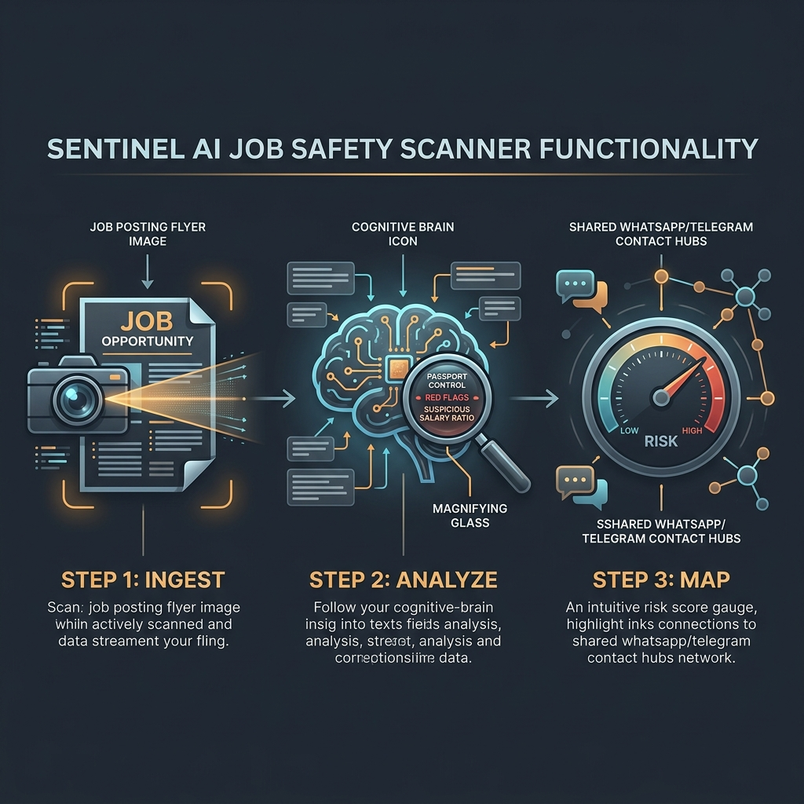
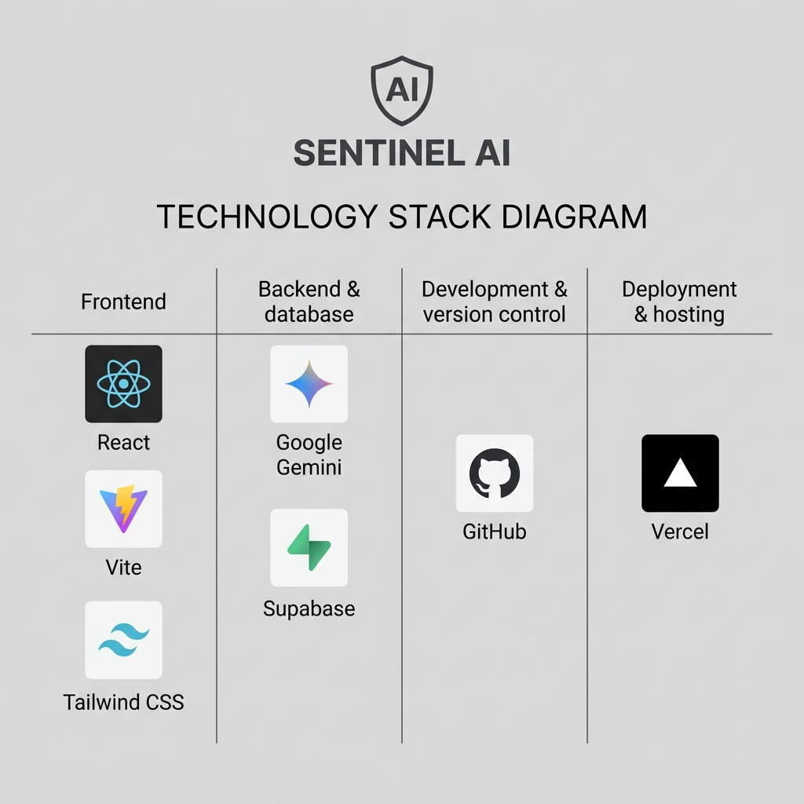

# Sentinel AI: Job Safety & OSINT Risk Registry

Sentinel AI is an analyst-first OSINT workspace and intelligence registry designed to scan, screen, and audit job advertisements/flyers for potential human trafficking, forced labor, or online cyber-scam compound recruitment.

By translating and dissecting suspicious postings, Sentinel AI provides a secure, structured platform for non-governmental organizations (NGOs), threat intelligence analysts, and advocacy groups to map organized deceptive recruitment campaigns.

---

## 📸 System Infographics

### 1. Simple Workflow Overview
Below is a high-level representation of the 3-step Sentinel AI ingestion, heuristics analysis, and connections mapping workflow:



### 2. Technology Stack Architecture
The following minimalist layer diagram presents the core stack and integrations driving the platform:



---

## 🛠️ Key Features

- **Multimodal OCR Scanner**: Capture images directly via camera or upload screenshots to instantly extract candidate-facing text from graphics.
- **24-Indicator Risk Heuristics**: Evaluates listings against a composite matrix, flagging upfront fee requests, passport control/confining policies, housing compounds, and language/salary anomalies.
- **Dialect & Translation OSINT**: Harnesses Google Gemini model capabilities to identify translation artifacts (such as literal translations or mixed regional scripts) to pinpoint recruiter locations.
- **Deceptive Recruiter Hub Network**: Groups isolated posts into clusters based on shared communication handles (Telegram, WhatsApp, email) and character n-gram similarities.
- **Decoy Engagement Console**: Allows analysts to generate synthetic candidate personas and download metadata-sanitized CVs (PDF) to safely investigate recruiter requirements.
- **STIX 2.1 Threat Intel Exporter**: Packages scans, indicators, and recruiter entities into standard STIX JSON bundles to share intelligence with global enforcement task forces.

---

## 🚀 Setup & Local Configuration

### Prerequisites
- Node.js (v18+)
- npm

### 1. Clone & Install Dependencies
```bash
git clone https://github.com/r3mington/job-scanner.git
cd job-scanner
npm install
```

### 2. Environment Variables Configuration
Create a `.env` file in the root of the project with the following keys:
```env
# Google Gemini developer portal key
VITE_GEMINI_API_KEY="your_api_key_here"

# Supabase persistency credentials
VITE_SUPABASE_URL="https://your-project.supabase.co"
VITE_SUPABASE_ANON_KEY="your-anon-key-here"
```

### 3. Run the Development Server
```bash
npm run dev
```
Open [http://localhost:5173](http://localhost:5173) in your browser.

---

## 🧠 Architectural & Technical Depth

Sentinel AI combines client-side processing with edge and developer APIs:

- **Edge Proxy Fallbacks**: The system defaults to querying a secure Supabase Edge Function proxy (`gemini-proxy`) to keep credentials server-side. If the proxy function is unreachable, it automatically routes through an integrated direct Google API connection client-side.
- **Dexie.js Offline Cache**: Integrates IndexedDB to support continuous batched scanner sweeps. If connection to Supabase database is interrupted, scans are cached locally to prevent data loss.
- **Jaccard n-Gram Similarity**: Identifies templated spam campaigns by converting job text into overlapping character sequences and evaluating intersection ratios, linking related recruitments.

---

## 📦 Data Sources & Provenance

Every piece of data in Sentinel AI is **either synthetic or drawn from publicly available sources** — no live operations, no engagement with active networks:

1. **Public Telegram Channel Previews Only**: The live feed reads the *public web preview* of Telegram channels (`https://t.me/s/<channel>`) — the same pages Telegram serves to any logged-out browser. No accounts, no bots, no credentials, no joining of groups, and strictly read-only: the platform never posts, replies, or otherwise interacts with recruiters or channels.
2. **Fully Synthetic Exemplars & Decoys**: All demo content — the Gallery's curated exhibit pieces, decoy candidate personas, and generated CVs — is synthetic. Names, handles, phone numbers, and backstories are fictional composites of documented recruitment patterns; they do not correspond to any real person, organization, or contact point.
3. **Offline Demo Snapshot**: For resilience when the live edge function is unreachable, the app bundles a build-time snapshot of the same public channel previews (capture date noted in `src/data/telegramSnapshot.js`). It contains only what Telegram already publishes to the open web, and registry records ingested from it are tagged as snapshot-sourced.

This design complies with the hackathon's ethical & safety rules ("use publicly available, synthetic, or simulated data — do not engage with live networks").

---

## 🛡️ Ethics, Trauma-Informed Design & Do-No-Harm

In compliance with the **UN Do No Harm Guidelines** and humanitarian standards, Sentinel AI has undergone a rigorous ethical audit:

1. **Trauma-Informed Terminology**: Eliminated alarmist terms (such as *"Threat Database"* or *"Victim"*) in favor of neutral, survivor-centered vocabulary (such as **"Audit Registry"** and **"Affected Individual/Worker"**).
2. **Session-Bound Key Retention**: API keys entered by analysts in settings are stored strictly in `SessionStorage` rather than `LocalStorage` or databases. Closing the browser tab destroys the credential footprint.
3. **Print Output XSS Hardening**: The printable intelligence poster template escapes all OCR inputs and dynamic model assessments via a strict character escaper to mitigate Cross-Site Scripting (XSS) risks in analysts' local browser origins.
4. **Data Sanitization**: Exif metadata (camera logs, GPS coordinates) is stripped from all generated decoy candidate PDFs to protect analysts and research profiles during active OSINT operations.
